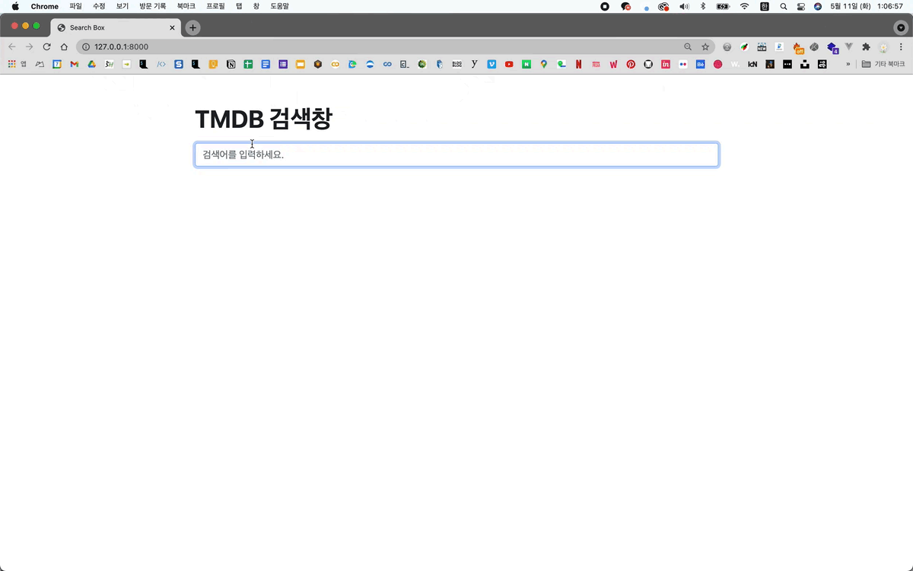

# 실시간 검색 박스

> written by Root_Kwak on May, 2021
>
> * [TMDB API](https://developers.themoviedb.org/3)


## 1. 프로젝트 설명

검색창에 연결된 Axios를 통해 검색창에 input 이벤트가 발생할 때마다 비동기적으로 키워드 관련 영화 목록을 출력합니다.

영화 목록은 TMDB API를 이용했고, html 디자인은 부트스트랩을 이용했습니다.


## 2. 결과물




## 3. 개발환경

- OS : macOS Big Sur
- Python : Python 3.8.6
- 라이브러리 항목은 requirements.txt 참고


## 4. 로컬 설치 방법

> 로컬에서 설치하려면 아래 방법을 순차적으로 실행하면 됩니다. (기본 로컬 서버 실행 주소 [127.0.0.1:8000](http://127.0.0.1:8000/))
>
> 외부 서버로 배포하려면 `$ python manage.py collectstatic` 및 사용하는 배포 서비스의 세부사항을 따르면 됩니다.

```
# 1. 가상환경 생성 및 실행
$ python3 -m venv venv
$ source venv/bin/activate

# 2. 라이브러리 설치
(venv)$ pip install -r requirements.txt

# 3. .env 생성 및 TMDB SPI_KEY, Django SECRET_KEY 입력

# 4. 서버 실행
(venv)$ python manage.py runserver
```


Fin.